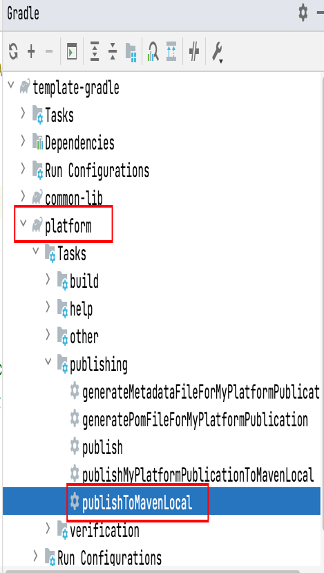

[English](./README.md) | [中文](./README-zh.md)

一个简单的 gradle 多模块项目示例

## 项目结构
> template-gradle 
> > platform : 定义项目版本号，类似maven的dependencyManagement
> 
> > common-lib : library模块，定义公共依赖,给其他模块使用
> 
> > server : spring boot web 示例
> 
## 运行

需要先将 platform 模块发布到本地，如图：

